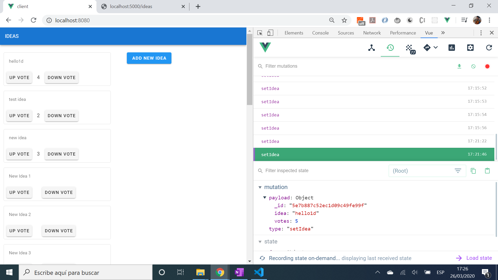
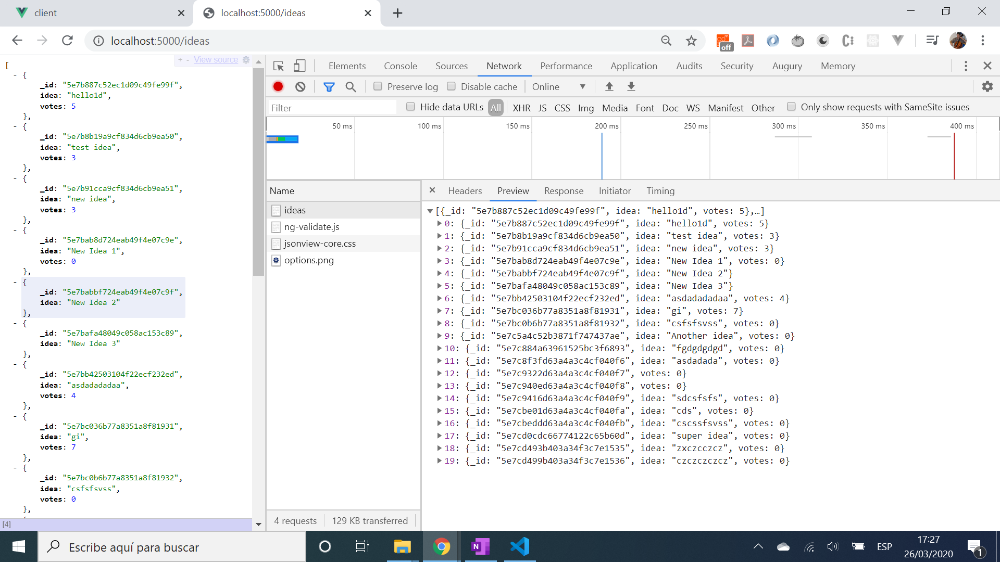

# mevn-stack-exchange

A MEVN full-stack app using MongoDB, Express.js, Vue and Node.js. User can create an idea and it is added to an ideas list. Each idea can be voted up and down with idea text and total votes shown in a Vue v-card.
* **Note:** to open web links in a new window use: _ctrl+click on link_


## Table of contents

* [General info](#general-info)
* [Screenshots](#screenshots)
* [Technologies](#technologies)
* [Setup](#setup)
* [Features](#features)
* [Status](#status)
* [Inspiration](#inspiration)
* [Contact](#contact)

## General info

* The project as a client-side for the frontend Vue framework and a server-side for the backend calls
* [Vue Router](https://router.vuejs.org/guide/essentials/navigation.html) used to navigate pages in browser
* [Node.js MongoDB Driver API](http://mongodb.github.io/node-mongodb-native/3.5/api/Collection.html#findOne) documentation used to create code for collection `find`, `findOne`, `insertOne`, etc.
* [Vuex](https://vuex.vuejs.org/api/#vuex-store) store used to hold application state

## MongoDB shell commands

* `mongo` - enter MongoDB console
* `show dbs` - list databases
* `use yt-ideas` - switch to database called 'yt-ideas'
* `show collections` - show all collections in database
* `db.ideas.find()` - (when switched to database 'yt-ideas' show contents of database

## Screenshots




## Technologies - Backend

* [MongoDB](https://www.mongodb.com/) NoSQL document database.
* [MongoDB v3.5.5](https://www.npmjs.com/package/mongodb) driver for Node.js
* [Express v4.17.1](https://www.npmjs.com/package/express)
* [Node.js v12.3.1](https://nodejs.org/en/)

## Technologies - Frontend

* [Vue v2](https://vuejs.org/)
* [Vuex v3](https://vuex.vuejs.org/) state management
* [Vue.js devtools chrome extension](https://chrome.google.com/webstore/detail/vuejs-devtools/nhdogjmejiglipccpnnnanhbledajbpd?hl=en)
* [Vuetify Material Design](https://vuetifyjs.com/en/) for v-card, v-textarea etc-
* [Axios v0.19.2](https://www.npmjs.com/package/axios)

## Setup - Backend

* In the `server` directory install dependencies using "npm install", then run using "nodemon index.js"

## Setup - Frontend

* In the `client` directory install dependencies using "npm install", then run using "npm start serve".

## Code Examples - Backend

* extract from `db.js` - getClient method to connect to MongoDB database

```javascript
exports.getClient = async () => {
  return new Promise((resolve, reject) => {
    if (!db) {
      // Use connect method to connect to the server
      MongoClient.connect(
        url,
        { useUnifiedTopology: true, useNewUrlParser: true },
        function(err, client) {
          assert.equal(null, err);
          console.log("Connected successfully to server");
          db = client.db(dbName);
          resolve(db);
        }
      );
    } else {
      resolve(db);
    }
  });
};
```

## Code Examples - Frontend

* extract from `index.js` to get list of ideas using the axios http get method

```javascript
const getBasePath = () => {
  return "http://localhost:5000";
}

export const getIdeas = async () => {
  const { data: ideas } = await axios.get(`${getBasePath()}/ideas`);
  return ideas;
};
```

## Features

* [Vuex](https://vuex.vuejs.org/) state management used as a central store for all components. Mutations used to commit and track changes
* [Axios](https://github.com/axios/axios) used to perform post request

## Status & To-Do List

* Status: Working frontend & Backend MongoDB database stores idea objects with id, idea text and votes number.
* To-Do: Fix issue: votes total on v-card does not update, even though votes total is corrrectly stored in the database.

## Inspiration

* [Web Dev Junkie, Youtube: Live Coding a Full Stack Idea App with Vue, Express, and Mongo](https://www.youtube.com/watch?v=myJRnwzw5ss)
* [Vue CLI 3 - Creating our Project](https://www.vuemastery.com/courses/real-world-vue-js/vue-cli/)

## Contact

Repo created by [ABateman](https://www.andrewbateman.org) - feel free to contact me!
